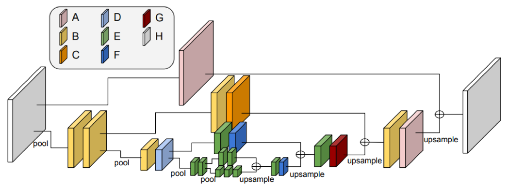
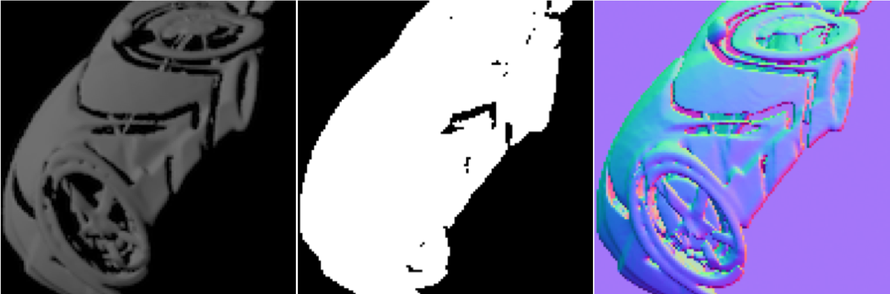
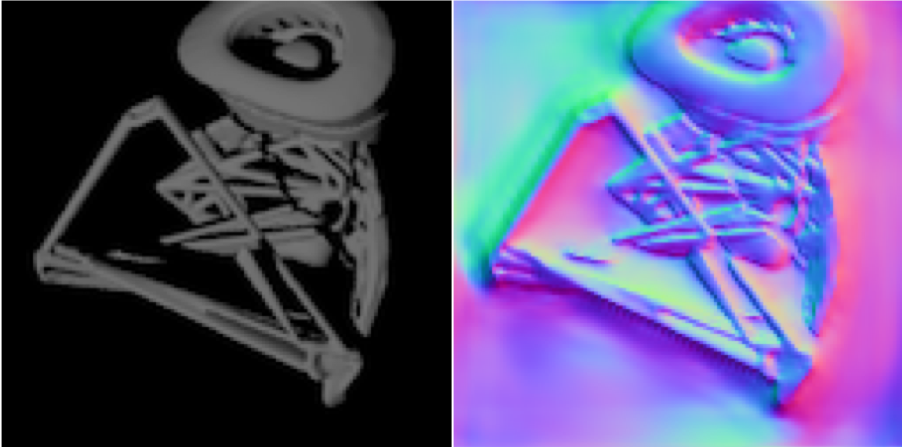
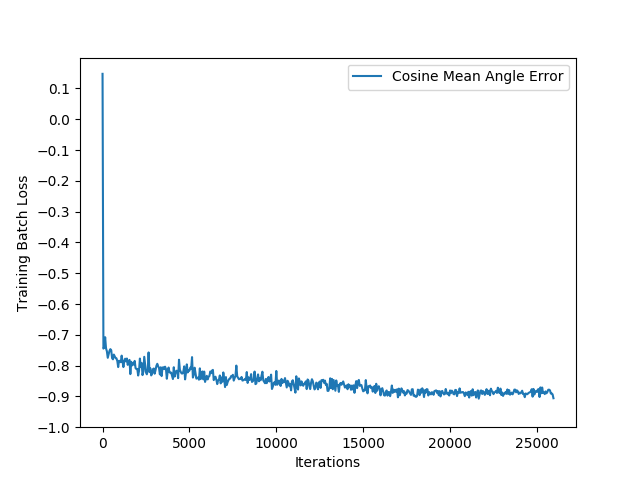

# single-image-surface-normal-estimation
PyTorch implementation of the hourglass architecture proposed in ["Single-Image Depth Perception in the Wild"](https://arxiv.org/abs/1604.03901) by Chen, et al. in NIPS 2016. Adapted for surface normal estimation instead of relative depth estimation. Achieves validation mean angle error of 0.435 (top in class).

## Network Architecture
Hourglass architecture consists of alternating max-pooling and Inception modules in the first half, and alternating upsampling and Inception modules in the second half. Information from multiple resolution scales is passed along and aggregated by the network.

## Data Format
Training data: single 128x128 RGB image of the object, its binary mask (white pixel only if object is present in that pixel), and a RGB image of the surface normal (where the color channels represent the 3D vectors).  
Validation: given a single 128x128 RGb image of the object and its binary mask, predict the surface normal orientation and output as a RGB image. Validation accuracy is calculated on the object's masked region, so not the background. There are 20,000 training images and 2,000 testing images to output predictions for. Data can be downloaded [here](http://cos429-f18.cs.princeton.edu/surface-normal-prediction-website-class-project/cos429.tgz).

**Sample input**:

**Sample output**:

## Training
Training loss curve is shown below. Adam optimizer worked quite well and converged quickly, but would overfit if run for too long. This phenomenon of adaptive gradient methods is reported in the literature as a "generalization gap". Taking inspiration from [Keskar and Socher, 2017](https://arxiv.org/abs/1712.07628), I switched to SGD after about 20 epochs, and reduced the learning rate + increased the batch size. I found this slow training phase helped me squeeze extra performance from the model and improve validation accuracy.

## Installation
1. Make sure data is downloaded into `data/` folder (so inner contents are `train/` and `test/`).
2. Install necessary libraries: `conda env create -f environment.yml`.
3. Activate Anaconda environment: `source activate surface_normal`.
4. `python train.py` (on GPU)

## Hardware
2 NVIDIA GTX 1080 Ti GPUs; roughly 2 hours of training (20 epochs) to get 0.45 validation accuracy, and 4.5 hours (40 epochs) to get 0.435.

## Reference
[1] Chen, W., Fu, Z., Yang, D. and Deng, J., 2016. Single-image depth perception in the wild. *Neural Information Processing Systems* (pp. 730-738).  
[2] Keskar, N. S., Socher, R., 2017. Improving Generalization Performance by Switching from Adam to SGD. *arXiv:1712.07628 [cs.LG]*.